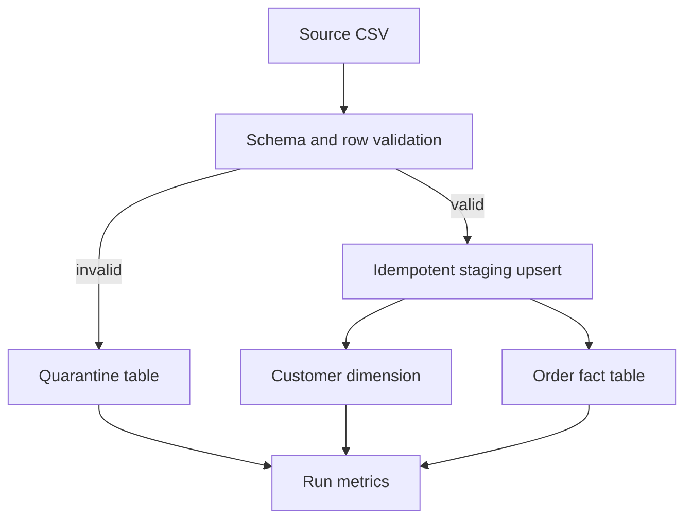

# Architecture and engineering decisions

## Goal

This repository is a small reference implementation of the reliability patterns used in larger
batch platforms. It loads order events from CSV into a local analytical warehouse while preserving
bad records for investigation and making reruns safe.

## Data flow



## Reliability properties

| Property | Implementation |
| --- | --- |
| Idempotency | `order_id` is the business key and a rerun does not duplicate facts. |
| Late updates | A record is updated only when `source_updated_at` is newer. |
| Batch deduplication | Multiple versions of one order are reduced to the newest version. |
| Data quality | Invalid amounts, statuses, identifiers, and timestamps are quarantined. |
| Atomicity | Staging, transformations, quarantine writes, and audit metrics share one transaction. |
| Reconciliation | Four SQL checks run after transformation and are stored for every batch. |
| Failure audit | Failed runs are persisted with their exception message after rollback. |
| Observability | Every execution emits JSON logs and writes counts and status to `pipeline_runs`. |
| Reproducibility | The pipeline has no runtime dependencies beyond Python and SQLite. |

## Warehouse model

- `staging_orders` stores the newest accepted source representation for every order.
- `dim_customers` assigns a surrogate key and tracks the first and last observed order time.
- `fact_orders` stores order-level measures and joins to the customer dimension.
- `quarantined_orders` preserves the raw record and all validation failures.
- `pipeline_runs` provides an audit trail for every execution.
- `data_quality_results` stores each post-transformation reconciliation result.

## Run locally

```bash
python -m venv .venv
source .venv/bin/activate
python -m pip install -e ".[dev]"
run-data-pipeline --input data/sample_orders.csv --database warehouse.db
pytest
```

The sample includes one negative amount to demonstrate quarantine behavior.

## Why SQLite first

SQLite keeps the first release runnable in minutes and makes the SQL and transaction boundaries
visible. The next milestones can replace the local storage layer with DuckDB or PostgreSQL, then
add orchestration and a cloud object-store landing zone without changing the core reliability
contract.

## Planned milestones

1. Add a run-health summary command over the audit tables.
2. Add Docker Compose with PostgreSQL.
3. Add orchestration and backfill support.
4. Add a Spark implementation for partitioned, higher-volume data.
