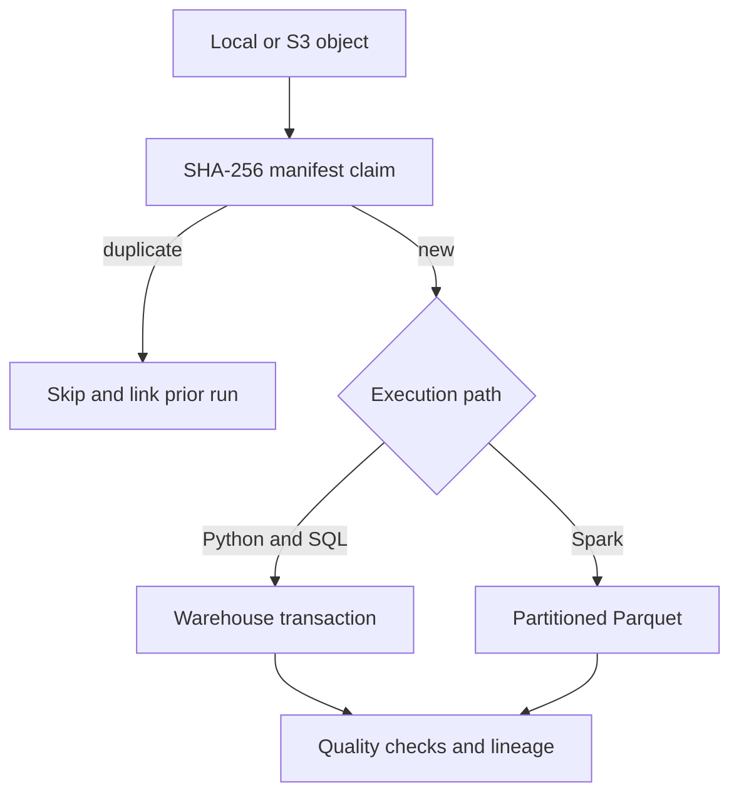

# Architecture and engineering decisions

## Goal

This repository is a small reference implementation of the reliability patterns used in larger
batch platforms. It loads order events from local or S3-compatible object storage into either an
analytical warehouse or partitioned Parquet datasets while preserving bad records, recording file
lineage, and making reruns safe.

## Data flow



## Reliability properties

| Property | Implementation |
| --- | --- |
| Idempotency | `order_id` is the business key and a rerun does not duplicate facts. |
| Late updates | A record is updated only when `source_updated_at` is newer. |
| Batch deduplication | Multiple versions of one order are reduced to the newest version. |
| Data quality | Invalid amounts, statuses, identifiers, and timestamps are quarantined. |
| Atomicity | Staging, transformations, quarantine writes, and audit metrics share one transaction. |
| Reconciliation | Four SQL checks run after transformation and are stored for every batch. |
| Failure audit | Failed runs are persisted with their exception message after rollback. |
| Observability | Every execution emits JSON logs and writes counts and status to `pipeline_runs`. |
| Portability | The same pipeline contract runs against SQLite and PostgreSQL. |
| Schema evolution | Ordered SQL migrations are recorded in `schema_migrations`. |
| Concurrency control | A database-backed lock prevents overlapping pipeline writers. |
| Safe replay | Date partitions can be rerun without duplicating facts. |
| Retry control | Transient database and lock failures use bounded exponential backoff. |
| Exactly-once files | A unique SHA-256 checksum claim prevents duplicate file content. |
| Object lineage | URI, checksum, size, ETag, batch date, status, and run ID are persisted. |
| Spark schema control | Source fields enter as strings and are explicitly parsed into typed columns. |
| Deterministic Spark deduplication | A window keeps the newest source version with a stable tie-breaker. |
| Partition isolation | Spark uses dynamic overwrite for the requested `batch_date` partition. |
| Reproducibility | Docker Compose starts PostgreSQL and runs the pipeline locally. |

## Warehouse model

- `staging_orders` stores the newest accepted source representation for every order.
- `dim_customers` assigns a surrogate key and tracks the first and last observed order time.
- `fact_orders` stores order-level measures and joins to the customer dimension.
- `quarantined_orders` preserves the raw record and all validation failures.
- `pipeline_runs` provides an audit trail for every execution.
- `data_quality_results` stores each post-transformation reconciliation result.
- `pipeline_locks` stores expiring ownership records for active writers.
- `file_manifest` stores object identity, processing state, and file-to-run lineage.

## Run locally

```bash
python -m venv .venv
source .venv/bin/activate
python -m pip install -e ".[dev]"
run-data-pipeline --input data/sample_orders.csv --database-url sqlite:///warehouse.db
pytest
```

The sample includes one negative amount to demonstrate quarantine behavior.

## Storage modes

SQLite keeps the learning path runnable in minutes. PostgreSQL demonstrates the same reliability
contract against a production-grade database, with dialect-specific DDL and transformations kept
in version-controlled SQL. GitHub Actions runs the test suite against PostgreSQL on every pull
request.

## Spark processing path

`data-platform-spark` runs the same landed object through a Spark DataFrame transformation. It
uses an explicit input schema, validates every business field, and separates rejected rows with a
raw JSON payload and human-readable error reason. A window function partitions by `order_id` and
keeps the greatest `source_updated_at`, with a row hash as a deterministic tie-breaker.

The two output datasets are:

- `accepted_orders/batch_date=YYYY-MM-DD`: typed, deduplicated order records
- `quarantined_orders/batch_date=YYYY-MM-DD`: raw payloads, errors, and run identifiers

Four Spark-specific quality checks run before the write and are persisted in
`data_quality_results`. The run itself is written to `pipeline_runs` with `trigger_type = 'spark'`.
The manifest is only marked successful after Spark completes, so failed files remain retryable.

Spark is optional because it solves a different workload from the transactional loader. The
Python and SQL path remains the clearest option for small atomic warehouse batches, while Spark
provides a cluster-ready path for larger partitioned datasets.

Run the complete PostgreSQL stack with:

```bash
docker compose up --build
```

Inspect the latest run with:

```bash
data-platform-health --database-url sqlite:///warehouse.db
```

## Backfills and orchestration

Historical partitions are replayed through the same validation, transformation, reconciliation,
and audit path as a manual run:

```bash
data-platform-backfill \
  --start-date 2026-08-25 \
  --end-date 2026-08-27 \
  --source-template 'data/partitions/date={date}/orders.csv' \
  --database-url sqlite:///warehouse.db
```

Each run stores `batch_date` and `trigger_type`. A replay is safe because staging and fact tables
use business-key upserts with source-version comparisons. Locks expire automatically so a crashed
worker cannot block the pipeline permanently.

## Object landing and exactly-once processing

`data-platform-land` accepts a local path, `file://` URI, or `s3://` URI. The object is streamed to
a temporary local file when necessary, hashed with SHA-256, and claimed through a unique manifest
constraint before parsing begins. A succeeded checksum is never processed twice, even when the
same bytes arrive under another object key.

Failed manifest entries remain retryable. A later attempt can reclaim the same checksum, while an
actively processing checksum is rejected so concurrent workers cannot duplicate work.

## Planned milestones

1. Publish run-health metrics to an observability dashboard.
2. Add scheduled orchestration with Airflow or Dagster.
