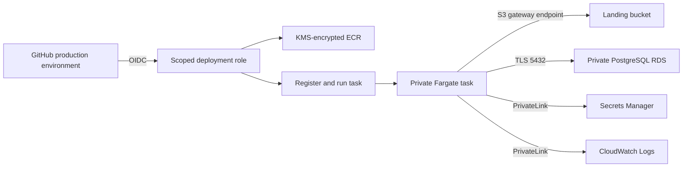

# On-demand ECS deployment runbook

This runbook bootstraps and operates the optional AWS runtime. Terraform creates the private
execution environment once. After that, an approval-protected GitHub workflow builds an immutable
image and launches one Fargate task for one source partition.

## Architecture



There is no ECS service, load balancer, public IP, NAT gateway, or internet gateway. A task exists
only for the duration of one manually requested partition run.

## 1. Bootstrap AWS with Terraform

The first apply requires an AWS identity that can create VPC endpoints, IAM roles, an OIDC
provider, ECR, ECS, KMS, RDS, S3, and CloudWatch resources. The GitHub deployment role does not
apply Terraform and cannot bootstrap itself.

```bash
cp infrastructure/terraform.tfvars.example infrastructure/terraform.tfvars
```

Set these values:

```hcl
enable_ecs_runtime = true
github_repository  = "kdgmax/production-data-platform"
github_environment = "production"
```

If the AWS account already has the GitHub Actions OIDC provider, set
`github_oidc_provider_arn` so Terraform reuses it instead of trying to create a duplicate.

Review and apply:

```bash
terraform -chdir=infrastructure init
terraform -chdir=infrastructure plan
terraform -chdir=infrastructure apply
terraform -chdir=infrastructure output github_deploy_role_arn
```

No AWS resources are created by the repository's normal CI workflow.

## 2. Protect the GitHub deployment environment

In GitHub, create an environment named `production` under repository settings. Configure:

- Required reviewers
- Deployment branches restricted to `main`
- `AWS_DEPLOY_ROLE_ARN` as an environment variable using the Terraform output
- `AWS_REGION` as an environment variable, such as `us-east-1`
- `DEPLOYMENT_ENVIRONMENT` as an environment variable matching Terraform, such as `dev`

The AWS trust policy accepts only the OIDC subject for this repository's `production` environment.
It does not trust pull-request subjects, arbitrary branches, forks, or other repositories.

## 3. Upload a partition

Use the `landing_bucket` Terraform output and upload an orders CSV:

```bash
aws s3 cp data/sample_orders.csv \
  "s3://$(terraform -chdir=infrastructure output -raw landing_bucket)/orders/date=2026-08-27/orders.csv"
```

## 4. Run the workflow

Open Actions, choose `Deploy and run ECS pipeline`, and select `Run workflow` from `main`.

Provide:

- `batch_date`: `2026-08-27`
- `source_key`: `orders/date=2026-08-27/orders.csv`
- `confirmation`: `deploy`

After environment approval, the workflow:

1. Exchanges GitHub's OIDC token for short-lived AWS credentials.
2. Builds `Dockerfile.ecs` and pushes an immutable commit-SHA image to ECR.
3. Registers a new task-definition revision for that exact image.
4. Discovers the tagged private subnets and no-ingress runtime security group.
5. Starts one Fargate 1.4 task without a public IP.
6. Waits for completion and fails the workflow if the container exit code is nonzero.

The GitHub job summary records the source URI, batch date, ECS task ARN, exit code, and stop reason.
Application logs are stored under the `/data-platform/.../pipeline` CloudWatch log group.

## Credentials and network boundaries

RDS manages the database secret. The ECS agent injects only its `host`, `port`, `dbname`,
`username`, and `password` JSON keys. The application URL-encodes credentials, requires PostgreSQL
TLS, and never logs the completed connection URL.

The task execution role can pull only the pipeline ECR repository, write only the pipeline log
group, and retrieve only the RDS-managed secret. The application task role is limited to the two
data buckets and their KMS key.

Fargate pulls the image through private ECR API and registry endpoints plus the existing S3
gateway endpoint. Secrets Manager, KMS, and CloudWatch Logs also use interface endpoints. Security
groups allow only DNS, HTTPS to private services, S3 HTTPS, and PostgreSQL to the RDS group.

## Cost controls

`enable_ecs_runtime` defaults to `false`. Enabling it creates interface endpoints that incur hourly
charges even when no task is running. RDS also remains a continuously billed resource. Fargate
compute is billed only while a task runs, and no ECS service maintains idle tasks.

The task uses 0.25 vCPU and 512 MiB, ECR removes untagged images after seven days, and only the 20
newest immutable images are retained. Always review current AWS pricing in the chosen region before
applying.

## Failure investigation

If a run fails:

1. Read the workflow job summary for the ECS task ARN and stop reason.
2. Inspect the `ecs/pipeline/...` stream in the pipeline CloudWatch log group.
3. Confirm the source key exists in the landing bucket.
4. Confirm the five interface endpoints are available in both private subnets.
5. Confirm the RDS-managed secret contains the expected PostgreSQL JSON keys.

Exactly-once manifest handling leaves failed objects retryable, so the same workflow inputs can be
replayed after the underlying issue is corrected.

