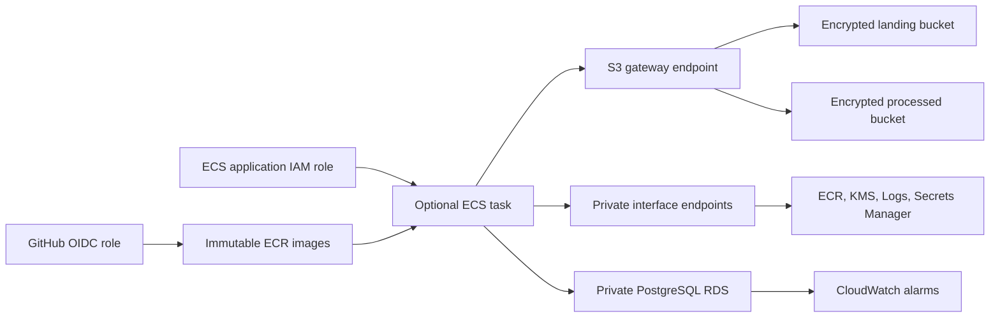

# AWS infrastructure

This Terraform module provisions the secure data layer and an optional on-demand ECS runtime for
the production data platform. It is a deployable foundation, not a claim that every workload should
use the same AWS topology.

## Architecture



The VPC spans two private subnets in separate availability zones. It has no internet gateway and
no NAT gateway. S3 traffic stays on the S3 gateway endpoint. KMS, CloudWatch Logs, and Secrets
Manager interface endpoints are optional because they add hourly cost and become useful only when
private workers are deployed.

## Resources

| Area | Resources and controls |
| --- | --- |
| Network | VPC, two private subnets, isolated route tables, S3 gateway endpoint |
| Storage | Landing and processed S3 buckets, versioning, KMS encryption, TLS-only policies, lifecycle retention |
| Database | PostgreSQL 16 RDS, private access, encrypted storage, managed password, backups, deletion protection |
| Identity | Separate ECS application and execution roles with resource-scoped S3, KMS, ECR, logs, and secret permissions |
| Monitoring | RDS CPU and free-storage alarms plus an encrypted pipeline log group |
| Compute | Optional ECR repository, ECS cluster, Fargate task definition, and no-ingress task security group |
| Deployment | Optional GitHub OIDC provider and environment-scoped deployment role |

## Validate locally

Terraform 1.15 is required.

```bash
terraform -chdir=infrastructure init
terraform -chdir=infrastructure fmt -check
terraform -chdir=infrastructure validate
```

Initialization and validation read provider schemas but do not create AWS resources. Pull-request
CI runs these commands with the backend disabled.

## Plan a deployment

Copy the example variables and review every value before planning:

```bash
cp infrastructure/terraform.tfvars.example infrastructure/terraform.tfvars
terraform -chdir=infrastructure plan
```

The default database is a small single-AZ development instance. Set `database_multi_az = true`
for production availability. Keep `protect_database = true` and `force_destroy_buckets = false`
for durable environments.

`database_client_security_group_ids` is empty by default, so nothing external can connect to
PostgreSQL. Add only the security group IDs of approved workers. Do not add a public CIDR.

Set `enable_ecs_runtime = true` to add the on-demand compute path. This automatically creates the
private ECR, Secrets Manager, KMS, and CloudWatch Logs endpoints required by a Fargate task that has
no NAT gateway and no public IP. Follow the [ECS deployment runbook](../docs/ecs-deployment.md) for
the AWS bootstrap and GitHub environment setup.

## Remote state

This module intentionally does not hard-code a backend. Before team use, create a separate,
versioned and encrypted state bucket, then configure an S3 backend according to the organization’s
bootstrap process. Never commit `.tfstate` or populated `.tfvars` files.

## Cost controls

- There is no NAT gateway, internet gateway, ECS service, load balancer, or EMR cluster.
- The S3 gateway endpoint has no hourly endpoint charge.
- Interface endpoints are disabled by default because each endpoint incurs hourly and data charges.
- S3 objects transition to lower-cost storage and expire after the configured retention period.
- RDS uses a small development class by default and storage autoscaling is capped at 100 GiB.
- The optional Fargate task uses 0.25 vCPU and 512 MiB only while a partition is running.
- ECS-required interface endpoints incur hourly charges whenever the optional runtime is enabled.

Always inspect the plan and the AWS pricing for the selected region before applying. Destroying
the module can be blocked by RDS deletion protection and non-empty S3 buckets, by design.

## Secrets and deployment boundary

RDS generates and rotates the master password through Secrets Manager. Terraform outputs only the
secret ARN, not the credential value. The ECS execution role can read only that secret for container
startup. The application task role can use only the two data buckets and their KMS key.

No GitHub workflow applies this module. The manual ECS workflow uses GitHub OIDC with a short-lived,
environment-scoped AWS role and an approval-protected environment. Static access keys do not belong
in repository secrets.

